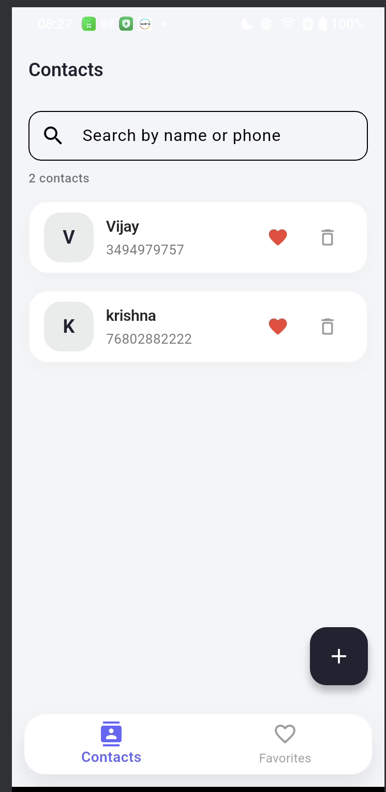
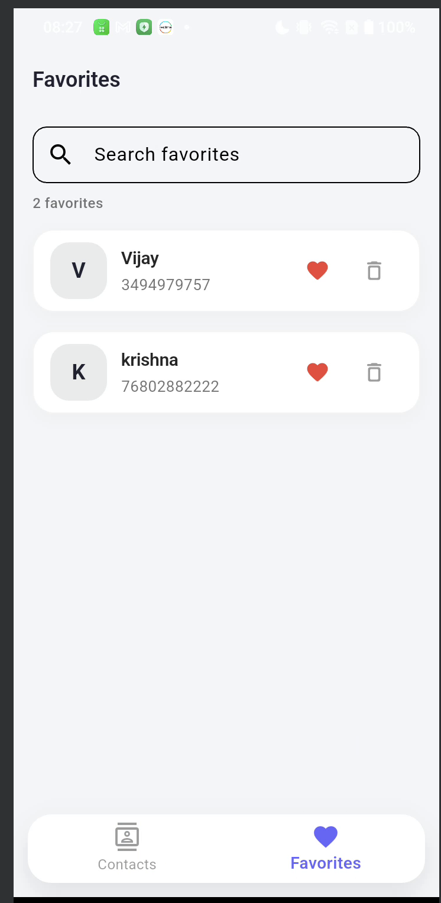
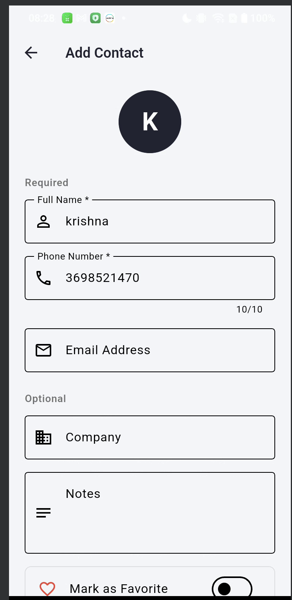
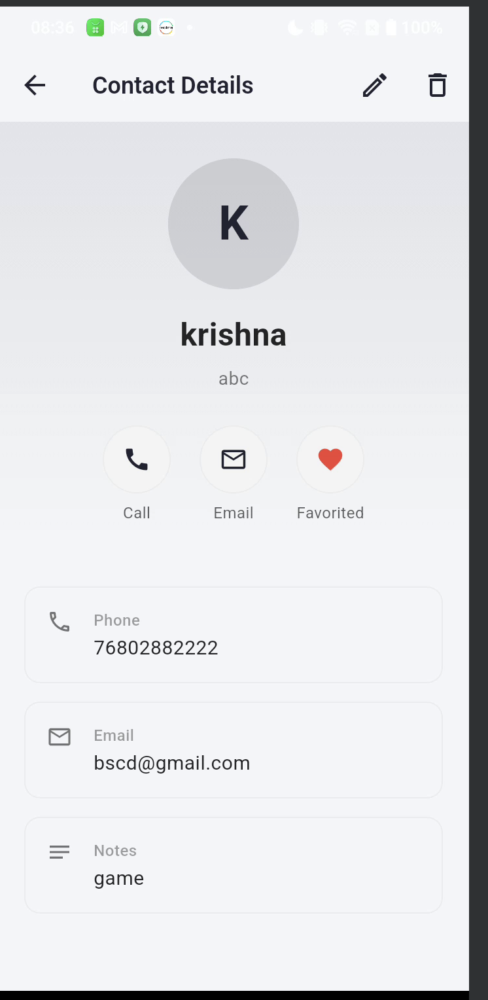

# Google Contacts Clone - Flutter

A modern Google Contacts inspired Flutter application built using Clean Architecture, BLoC state management, and Firebase Firestore.

---

# Features

✅ Add Contact  
✅ Update Contact  
✅ Delete Contact  
✅ Favorite / Unfavorite Contact  
✅ Real-time Firestore Sync  
✅ Search Contacts  
✅ Call Integration  
✅ Email Integration  
✅ Beautiful Minimal UI  
✅ Error Handling  
✅ Loading States  
✅ Clean Architecture  
✅ BLoC State Management  

---

# Screenshots

| Contacts | Favorites |
|-----------|------------|
|  |  |

| Add Contact | Details |
|--------------|----------|
|  |  |

---

# Architecture

This project follows:

- Clean Architecture
- Feature First Structure
- Repository Pattern
- SOLID Principles
- BLoC State Management

---

# Tech Stack

- Flutter
- Dart
- Firebase Firestore
- flutter_bloc
- freezed
- go_router
- url_launcher

---

# Folder Structure

```bash
lib/
│
├── core/
│   ├── error/
│   ├── utils/
│
├── features/
│   └── contacts/
│       ├── data/
│       │   ├── datasource/
│       │   ├── mapper/
│       │   ├── model/
│       │   └── repository/
│       │
│       ├── domain/
│       │   ├── entities/
│       │   ├── repositories/
│       │   └── usecases/
│       │
│       └── presentation/
│           ├── bloc/
│           ├── screens/
│           └── widgets/
```

---

# State Management

This app uses BLoC for predictable and scalable state management.

Each feature contains:

- Events
- States
- Business Logic
- UI Separation

---

# Firebase Setup

1. Create Firebase project
2. Enable Firestore Database
3. Add Android app
4. Download `google-services.json`
5. Place it inside:

```bash
android/app/
```

6. Run:

```bash
flutter pub get
```

---

# Installation

```bash
git clone https://github.com/godzkrishu/google-contact-flutter

cd google_contact

flutter pub get

flutter run
```

---

# Error Handling

This project contains centralized error handling using:

- ApiException
- ApiResponseHandler
- Failure Model
- TryCatchHelper

Handled Errors:

- No Internet
- Firebase Exceptions
- Duplicate Phone Numbers
- Invalid Data
- Unknown Errors

---

# Features Implemented

## Contact List

- Realtime Firestore updates
- Search contacts
- Favorite toggle
- Delete contact

## Contact Details

- Call action
- Email action
- Edit contact
- Favorite toggle

## Add/Edit Contact

- Form validation
- Duplicate phone validation
- Loading states
- Error handling

---

# Future Improvements

- Profile image upload
- Local storage caching
- Contact grouping
- Dark mode
- Contact import/export
- Pagination

---

# Author

Krishna Chauhan

Flutter Developer
